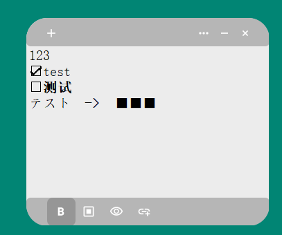

# MemoManage
a demo created using PyQt5

## Notify
- (more button)not finished
- ⬇button bugs about⬇
- add(doesn't work)
- hide(may not recover successfully when closed)
- link(can't successfully connect to browser)

